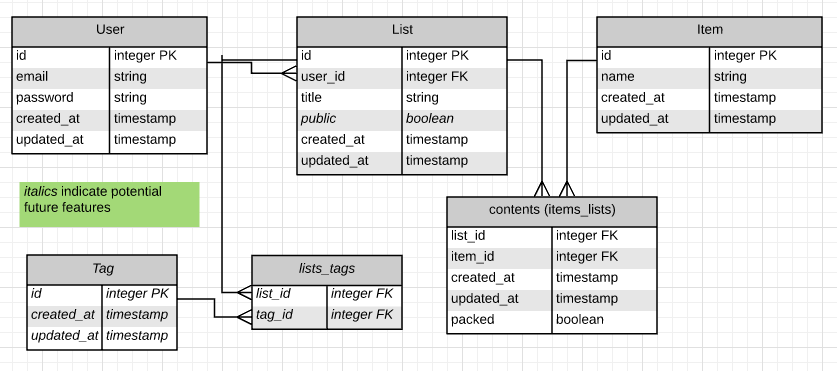

# Go Bag API

A Rails API for [Go Bag](https://github.com/rebekahheacock/go-bag), a packing list app. Includes authentication.

## Dependencies

-   [`rails-api`](https://github.com/rails-api/rails-api)
-   [`rails`](https://github.com/rails/rails)
-   [`active_model_serializers`](https://github.com/rails-api/active_model_serializers)
-   [`ruby`](https://www.ruby-lang.org/en/)
-   [`postgres`](http://www.postgresql.org)
-   [`deep_cloneable`](https://github.com/moiristo/deep_cloneable)


## API Documentation

Scripts are included in [`scripts`](scripts) to test built-in actions.

- [Authentication](#authentication)
- [Users](#users)
- [Lists](#lists)
- [Items](#items)
- [Contents](#contents)

### Data Model



### Authentication

| Verb   | URI Pattern            | Controller#Action |
|--------|------------------------|-------------------|
| [POST](#post-sign-up)   | `/sign-up`             | `users#signup`    |
| [POST](#post-sign-in)   | `/sign-in`             | `users#signin`    |
| [PATCH](#patch-change-passwordid)  | `/change-password/:id` | `users#changepw`  |
| [DELETE](#delete-sign-outid) | `/sign-out/:id`        | `users#signout`   |

#### POST /sign-up

Request:

```sh
curl --include --request POST http://localhost:3000/sign-up \
  --header "Content-Type: application/json" \
  --data '{
    "credentials": {
      "email": "an@example.email",
      "password": "an example password",
      "password_confirmation": "an example password"
    }
  }'
```

```sh
scripts/sign-up.sh
```

Response:

```md
HTTP/1.1 201 Created
Content-Type: application/json; charset=utf-8

{
  "user": {
    "id": 1,
    "email": "an@example.email"
  }
}
```

#### POST /sign-in

Request:

```sh
curl --include --request POST http://localhost:3000/sign-in \
  --header "Content-Type: application/json" \
  --data '{
    "credentials": {
      "email": "an@example.email",
      "password": "an example password"
    }
  }'
```

```sh
scripts/sign-in.sh
```

Response:

```md
HTTP/1.1 200 OK
Content-Type: application/json; charset=utf-8

{
  "user": {
    "id": 1,
    "email": "an@example.email",
    "token": "33ad6372f795694b333ec5f329ebeaaa"
  }
}
```

#### PATCH /change-password/:id

Request:

```sh
curl --include --request PATCH http://localhost:3000/change-password/$ID \
  --header "Authorization: Token token=$TOKEN" \
  --header "Content-Type: application/json" \
  --data '{
    "passwords": {
      "old": "an example password",
      "new": "super sekrit"
    }
  }'
```

```sh
ID=1 TOKEN=33ad6372f795694b333ec5f329ebeaaa scripts/change-password.sh
```

Response:

```md
HTTP/1.1 204 No Content
```

#### DELETE /sign-out/:id

Request:

```sh
curl --include --request DELETE http://localhost:3000/sign-out/$ID \
  --header "Authorization: Token token=$TOKEN"
```

```sh
ID=1 TOKEN=33ad6372f795694b333ec5f329ebeaaa scripts/sign-out.sh
```

Response:

```md
HTTP/1.1 204 No Content
```

### Users

| Verb | URI Pattern | Controller#Action |
|------|-------------|-------------------|
| GET  | `/users`    | `users#index`     |
| GET  | `/users/1`  | `users#show`      |

#### GET /users

Request:

```sh
curl --include --request GET http://localhost:3000/users \
  --header "Authorization: Token token=$TOKEN"
```

```sh
TOKEN=33ad6372f795694b333ec5f329ebeaaa scripts/users.sh
```

Response:

```md
HTTP/1.1 200 OK
Content-Type: application/json; charset=utf-8

{
  "users": [
    {
      "id": 2,
      "email": "another@example.email"
    },
    {
      "id": 1,
      "email": "an@example.email"
    }
  ]
}
```

#### GET /users/:id

Request:

```sh
curl --include --request GET http://localhost:3000/users/$ID \
  --header "Authorization: Token token=$TOKEN"
```

```sh
ID=2 TOKEN=33ad6372f795694b333ec5f329ebeaaa scripts/user.sh
```

Response:

```md
HTTP/1.1 200 OK
Content-Type: application/json; charset=utf-8

{
  "user": {
    "id": 2,
    "email": "another@example.email"
  }
}
```

### Lists

| Verb   | URI Pattern | Controller#Action |
|--------|-------------|-------------------|
| GET    | `/lists`    | `lists#index`     |
| GET    | `/lists/1`  | `lists#show`      |
| POST   | `/lists`    | `lists#create`    |
| POST   | `/clone/1`  | `lists#clone`     |
| PATCH  | `/lists/1`  | `lists#update`    |
| DELETE | `/lists/1`  | `lists#destroy`   |

#### GET /lists

Users are only permitted to access their own lists.

Request: 

```sh
curl --include --request GET http://localhost:3000/lists \
  --header "Authorization: Token token=$TOKEN"
```

```sh
TOKEN=33ad6372f795694b333ec5f329ebeaaa scripts/list-index.sh
```

Response:
```md
HTTP/1.1 200 OK 
Content-Type: application/json; charset=utf-8

{
  "lists": [
    {
      "id":1,
      "title":"Kampala in January",
      "contents": []
    },
    {
      "id": 2,
      "title": "RightsCon 2016",
      "contents": []
    },
```

#### GET /lists/1

Users are only permitted to access their own lists.

Request: 

```sh
curl --include --request GET http://localhost:3000/lists/$ID \
  --header "Authorization: Token token=$TOKEN"
```

```sh
ID=1 TOKEN=33ad6372f795694b333ec5f329ebeaaa scripts/list-show.sh
```

Response:

```md
HTTP/1.1 200 OK 
Content-Type: application/json; charset=utf-8

{
  "list": {
    "id": 1,
    "title": "Kampala in January",
    "contents": []
  }
}
```

#### POST /lists

Request:

```sh
curl --include --request POST http://localhost:3000/lists \
  --header "Content-Type: application/json" \
  --header "Authorization: Token token=$TOKEN" \
  --data '{
    "list": {
      "title": "Camping"
    }
  }'
```

```sh
TOKEN=33ad6372f795694b333ec5f329ebeaaa scripts/list-create.sh
```

Response: 

```md
HTTP/1.1 201 Created 
Content-Type: application/json; charset=utf-8

{
  "list": {
    "id": 3,
    "title": "camping",
    "contents": []
  }
}
```

#### POST /clone/1

A `POST` request to `/clone/:id` clones the provided list with all of its associations. The cloned list's title will be "Copy of [original list's title]."

Request:

```sh
curl --include --request POST http://localhost:3000/clone/$ID \
  --header "Content-Type: application/json" \
  --header "Authorization: Token token=$TOKEN" \
  --data '{}'
```

```sh
ID=2 TOKEN=33ad6372f795694b333ec5f329ebeaaa scripts/list-clone.sh
```

Response: 
```md
HTTP/1.1 201 Created
Content-Type: application/json; charset=utf-8

{
  "list": {
    "id": 4,
    "title": "Copy of camping",
    "contents": []
  }
}
```

#### PATCH /lists/1

Request:

```sh
curl --include --request PATCH http://localhost:3000/lists/$ID \
  --header "Content-Type: application/json" \
  --header "Authorization: Token token=$TOKEN" \
  --data '{
    "list": {
      "title": "Acadia Hiking"
    }
  }'
```

```sh
ID=4 TOKEN=33ad6372f795694b333ec5f329ebeaaa scripts/list-update.sh
```

Response: 
```md
HTTP/1.1 204 No Content
```

#### DELETE /lists/1

Request:
```sh
curl --include --request DELETE http://localhost:3000/lists/$ID \
  --header "Authorization: Token token=$TOKEN"
```

```sh
ID=1 TOKEN=33ad6372f795694b333ec5f329ebeaaa scripts/list-destroy.sh
```

Response:
```md
HTTP/1.1 204 No Content
```

### Items

| Verb   | URI Pattern       | Controller#Action |
|--------|-------------------|-------------------|
| GET    | `/items`          | `lists#index`     |
| GET    | `/items/?query=j` | `items#index`     |
| GET    | `/items/1`        | `lists#show`      |
| POST   | `/items`          | `lists#create`    |
| PATCH  | `/items/1`        | `lists#update`    |
| DELETE | `/items/1`        | `lists#destroy`   |

#### GET /items

Request:
```sh
curl --include --request GET http://localhost:3000/items
```

```sh
scripts item-index.sh
```

Response:
```md
HTTP/1.1 200 OK 
Content-Type: application/json; charset=utf-8

{
  "items": [
    {
      "id": 1,
      "name": "jacket"
    },
    {
      "id": 2,
      "name": "laptop"
    },
    {
      "id": 3,
      "name": "jeans"
    }
  ]
}
```

#### GET /items?query=j

Request:
```sh
curl --include --request GET http://localhost:3000/items?query=$QUERY
```

```sh
QUERY=j scripts/item-search.sh
```

Response:
```md
HTTP/1.1 200 OK 
Content-Type: application/json; charset=utf-8

{
  "items": [
    {
      "id": 1,
      "name": "jacket"
    },
    {
      "id": 3,
      "name": "jeans"
    }
  ]
}
```

#### GET /items/1

Request:
```sh
curl --include --request GET http://localhost:3000/items/$ID
```

```sh
ID=1 scripts/item-show.sh
```

Response:
```md
HTTP/1.1 200 OK 
Content-Type: application/json; charset=utf-8

{
  "item": {
    "id": 1,
    "name": "jacket"
  }
}
```

#### POST /items

Request:
```sh
curl --include --request POST http://localhost:3000/items \
  --header "Content-Type: application/json" \
  --header "Authorization: Token token=$TOKEN" \
  --data '{
    "item": {
      "name": "shirt"
    }
  }'
```

```sh
TOKEN=33ad6372f795694b333ec5f329ebeaaa scripts/item-create.sh
```

Response: 
```md
HTTP/1.1 201 Created
Content-Type: application/json; charset=utf-8

{
  "item": {
    "id": 4,
    "name": "shirt"
  }
}
```

#### PATCH /items/1

Request:
```sh
curl --include --request PATCH http://localhost:3000/items/$ID \
  --header "Content-Type: application/json" \
  --header "Authorization: Token token=$TOKEN" \
  --data '{
    "item": {
      "name": "power adapter"
    }
  }'
```

```sh
ID=1 TOKEN=33ad6372f795694b333ec5f329ebeaaa scripts/item-update.sh
```

Response: 
```md
HTTP/1.1 204 No Content
```

#### DELETE /items/1

Request:
```sh
curl --include --request DELETE http://localhost:3000/items/$ID \
  --header "Authorization: Token token=$TOKEN"
```

```sh
ID=1 TOKEN=33ad6372f795694b333ec5f329ebeaaa scripts/item-destroy.sh
```

Response:
```md
HTTP/1.1 204 No Content
```

### Contents

| Verb   | URI Pattern    | Controller#Action  |
|--------|----------------|--------------------|
| POST   | `/contents`    | `contents#create`  |
| PATCH  | `/contents/1`  | `contents#update`  |
| DELETE | `/contents/1`  | `contents#destroy` |

#### POST /contents

Request:
```sh
curl --include --request POST http://localhost:3000/contents \
  --header "Content-Type: application/json" \
  --header "Authorization: Token token=$TOKEN" \
  --data '{
    "content": {
      "item_id": "2",
      "list_id": "1",
      "packed": false
    }
  }'
```

```sh
TOKEN=33ad6372f795694b333ec5f329ebeaaa scripts/content-create.sh
```

Response: 
```md
HTTP/1.1 201 Created 
Content-Type: application/json; charset=utf-8

{
  "content": {
    "id": 1,
    "packed": false,
    "item": {
      "id":2,
      "name": "laptop",
      "created_at": "2016-10-01T16:30:25.224Z",
      "updated_at": "2016-10-01T16:30:25.224Z"
    },
    "list": {
      "id": 1,
      "title": "Kampala in January"
    }
  }
}
```

#### DELETE /contents/1

Request:
```sh
curl --include --request DELETE http://localhost:3000/contents/$ID \
  --header "Authorization: Token token=$TOKEN"
```

```sh
ID=1 TOKEN=33ad6372f795694b333ec5f329ebeaaa scripts/content-destroy.sh
```

Response:

```md
HTTP/1.1 204 No Content
```


## [License](LICENSE)

1.  All content is licensed under a CC­BY­NC­SA 4.0 license.
1.  All software code is licensed under GNU GPLv3.
